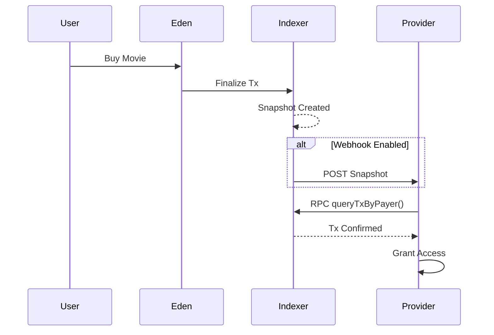

# 🌳 The Garden of Eden (Eden)

**Whitepaper v1.0 – Indexer‑First, Intelligence‑Native Marketplace**

Author: Bill Draper (CTO)  
Date: 2026

---

## Abstract

Eden is an **indexer‑first economic and intelligence system** where the traditional blockchain is no longer the parent, but the *child* of the indexer. Eden replaces gas fees, smart‑contract rigidity, and token‑centric governance with **LLM‑governed intelligence fees**, **federated indexers**, and a **ROOT Certificate Authority (ROOT CA)** that certifies trust, services, and replication.

Eden is designed to be:
- Gas‑free
- Indexer‑driven
- LLM‑native
- Service‑oriented
- Self‑policing, self‑governing, and self‑replicating

---

## 1. Core Philosophy

> *Blockchain records history. Eden understands it.*

Eden assumes:
- History is immutable
- Meaning is contextual
- Trust is certified, not mined
- Intelligence is the new gas

Indexers are **priests**, not miners. ROOT CA is **law**, not power. Users are **free actors**, not wallet addresses.

---

## 2. System Actors

### 2.1 ROOT CA (Law / Moses)
- Global certification authority
- Certifies indexers and services
- Collects minimal intelligence fee (≈0.001%)
- Guarantees fallback, insurance, and dispute resolution

### 2.2 Indexers (Knowledge Trees)
- Federated, Docker‑deployed nodes
- In‑memory Redis‑like databases
- Run identical LLM versions (DeepSeek‑class)
- Hold certificates + private keys
- Provide intelligence, routing, pricing, and policing

#### 2.2.1 Regular Indexers
- General-purpose indexers for all service types
- Handle movie bookings, content, APIs, marketplaces
- Process transactions and maintain service registry

#### 2.2.2 Token Indexers (Specialized)
- Specialized indexers dedicated to DEX token/pool services
- Manage token pools, liquidity, and trading operations
- Provide DEX-specific routing and pricing intelligence
- Each token indexer can manage multiple token pools
- Identified by `TokenIndexer-T1`, `TokenIndexer-T2`, etc.

### 2.3 Users (Humans)
- Google‑certified identity (email only)
- No wallets required
- Multiple identities allowed
- Pay via intelligence usage (iGas)

### 2.4 Service Providers (Apples on Trees)
- Movies, DEX pools, content, goods, APIs, marketplaces
- Register via ServiceRegistry
- Bonded and reputation‑scored
- Can be legacy platforms (AMC, MovieCom, etc.)

---

## 3. Indexer‑First Architecture

```
User (Chat API)
     ↓
Service Router (Federated)
     ↓
Indexer A —— Indexer B —— Indexer C
  |          |           |
 LocalStore  LocalStore   LocalStore
     ↓           ↓            ↓
TokenIndexer-T1 —— TokenIndexer-T2
  |                    |
DEX Pools          DEX Pools
     ↓           ↓            ↓
   Replication Bus (Redis‑style)
     ↓
EdenCore (Ledger + Snapshots)
```

Key rule:
> **If an indexer can answer it, the chain does not need to exist.**

---

## 4. Event‑Driven Replication Bus

Eden uses a **database‑level replication model** instead of consensus mining.

### Event Types
- `SNAPSHOT` – transaction / action
- `SERVICE_UPDATE` – price, availability
- `BOND_UPDATE` – trust & insurance changes

### Properties
- Deterministic
- Replayable
- Stateless consensus
- Redis Streams compatible

Indexers replicate state, not blocks.

---

## 5. Intelligence Gas (iGas)

- No blockchain gas
- No native token
- iGas = LLM + routing + reasoning cost

### iGas Calculation

iGas is calculated based on:
- **LLM calls**: Number of LLM interactions (query extraction, response formatting)
- **Providers queried**: Number of service providers consulted
- **Complexity**: Confidence score and query complexity

Formula:
```
iGas = (LLM_CALL_COST × llmCalls) + (ROUTING_COST × providersQueried) + (REASONING_COST × complexity)
```

### iGas Redistribution

| Recipient | Share | Purpose |
|---------|------|---------|
| ROOT CA | Governance & insurance | System maintenance, dispute resolution |
| Indexers | Compute & routing | Infrastructure costs, replication |
| Service Providers | Quality incentive | Reward for good service |
| Users | Usage credit | Rebates and loyalty rewards |

This creates a **positive‑sum economy** where all participants benefit from system growth.

---

## 6. Service Registry & Routing

- All services must be registered
- Each service includes:
  - Price
  - Location
  - Bond
  - Reputation

### Example User Query
> “I have 10 USDC. Where can I watch *Catch Me If You Can* tonight at best price?”

Flow:
1. Query broadcast to indexers
2. Indexers evaluate local + federated services
3. LLM aggregates best result
4. EdenCore executes transaction

---

## 7. Dynamic Bonds & Pricing

- Every successful transaction:
  - Increases service bond
  - Improves reputation
  - Can lower fees

- Poor service:
  - Bond reduced
  - Routing deprioritized

This replaces ratings with **economic truth**.

---

## 8. No‑Rug DEX Model (Optional Layer)

- Pools must be ROOT‑certified
- Creator cannot rug without losing bond
- Trades increase pool value slightly
- High‑frequency traders rewarded, not penalized

Eden supports DEX/CEX without native tokens.

### 8.1 Token Indexers & DEX Pools

DEX token/pool services are provided by **specialized token indexers**:

- Each token indexer manages one or more token pools
- Pools are assigned to token indexers at initialization
- Token indexers provide DEX-specific routing and intelligence
- LLM routes DEX queries to appropriate token indexers
- Example: "I want to BUY 2 SOLANA token A" → routed to TokenIndexer-T1 managing TOKENA pool

### 8.2 Price Impact & Pool Growth

- Each trade increases pool value by **0.001%** (price impact)
- Pool liquidity grows organically through trading activity
- Constant product formula (x × y = k) ensures price discovery
- No external liquidity providers required beyond initial ROOT CA liquidity

### 8.3 iTax: DEX Trading Commission

iTax is a **0.0005% commission** on all DEX trades, serving as a second liquidity source.

#### iTax Distribution (WIN-WIN-WIN Model)

| Recipient | Share | Purpose |
|---------|------|---------|
| ROOT CA | 40% | Governance & liquidity growth |
| Token Indexer | 30% | Reward for providing token pool services |
| Trader | 30% | Rebate back to buyer/seller |

This creates a **WIN-WIN-WIN** economy where:
- ROOT CA liquidity pool grows over time
- Token indexers are rewarded for service provision
- Traders receive rebates, incentivizing participation

#### iTax Flow Example

```
Trade Value: 1.0 SOL
iTax (0.0005%): 0.000005 SOL

Distribution:
├─ ROOT CA: 0.000002 SOL (40%) → Added to ROOT CA liquidity pool
├─ Indexer: 0.0000015 SOL (30%) → Reward to token indexer
└─ Trader: 0.0000015 SOL (30%) → Rebate added to user balance
```

### 8.4 ROOT CA Liquidity Pool

- Initial ROOT CA liquidity provides first liquidity source for DEX operations
- iTax contributions continuously grow ROOT CA liquidity
- ROOT CA liquidity acts as system-wide insurance and stability fund
- Enables new token pools to bootstrap without external capital

### 8.5 DEX Query Flow

1. User query: "I want to BUY 2 SOLANA token A at 1 Token/SOL or with best price"
2. LLM extracts: `serviceType: "dex"`, `tokenSymbol: "TOKENA"`, `baseToken: "SOL"`, `action: "BUY"`, `tokenAmount: 2`
3. Service Registry routes to DEX pool service providers
4. Token indexer provides pool listings with real-time prices
5. LLM selects best pool based on price and liquidity
6. Trade executes with price impact and iTax calculation
7. iTax distributed: ROOT CA (40%), Indexer (30%), Trader (30%)
8. Pool state updated, snapshot created, streamed to indexers

---

## 9. SaaS & Legacy Integration

Eden integrates via **API plugins**:
- AMC
- MovieCom
- Banks
- Wallets
- Payment processors

Legacy systems keep control; Eden handles intelligence, trust, and settlement.

---

## 10. Security & Identity

- Google identity only
- Email‑based trust
- Abuse detection via LLM policing
- No private key management for users

---

## 11. Deployment Model

- Docker‑only
- Low hardware requirements
- Horizontal scaling
- Stateless indexers

Each indexer = 1 Knowledge Tree

---

## 12. Eden‑Sim (Reference Implementation)

- TypeScript
- <1500 LOC
- No Web3 dependencies
- Mock LLM
- Redis‑style replication

Purpose: economic + architectural validation

---

## 13. Why Eden Wins

| Problem | Eden Solution |
|------|-------------|
| Gas fees | Intelligence fees |
| Smart contracts | Dynamic reasoning |
| Rug pulls | Bonded services |
| MEV | Certified transparency |
| Fragmentation | Federated indexers |

---

## 14. Genesis Statement

> *Eden is not a protocol.*  
> *It is a living system.*

ROOT CA gives law.  
Indexers give wisdom.  
Humans give meaning.

**The Garden grows.**

---

End of Whitepaper.


Absolutely.
Below is the **complete ENCERT v1 Redis Revocation Stream specification** regenerated as a **single, clean Markdown document**, ready to drop into your repo or whitepaper.

---

# ENCERT v1

## Redis Stream Schema — Revocation Events

**Status:** Draft v1
**Applies to:** ROOT CA, Indexers, Service Providers
**Transport:** Redis Streams
**Philosophy:** Event-driven trust, append-only authority

---

## 1. Purpose

This document defines the **Redis Streams schema** used by ENCERT v1 to propagate **revocation events** across the Eden ecosystem.

Revocation is:

* **Event-based**
* **Append-only**
* **Cryptographically signed**
* **Replayable and auditable**

No CRLs, OCSP, or polling mechanisms are used.

---

## 2. Stream Naming

### 2.1 Primary Stream

```text
eden:encert:revocations
```

### 2.2 Optional Sharding (Future)

```text
eden:encert:revocations:{region}
eden:encert:revocations:{indexer_id}
```

ENCERT v1 **SHOULD** begin with a single global stream.

---

## 3. Revocation Event Schema

Each Redis Stream entry represents **one immutable revocation fact**.

### 3.1 Required Fields

| Field          | Type   | Required | Description                        |
| -------------- | ------ | -------- | ---------------------------------- |
| `revoked_uuid` | string | ✅        | Identity being revoked             |
| `revoked_type` | string | ✅        | `indexer` | `service` | `provider` |
| `issuer_uuid`  | string | ✅        | Entity issuing revocation          |
| `reason`       | string | ✅        | Human-readable explanation         |
| `issued_at`    | int64  | ✅        | Unix timestamp (ms)                |
| `effective_at` | int64  | ✅        | When revocation becomes active     |
| `signature`    | string | ✅        | Base64 Ed25519 signature           |

### 3.2 Optional Fields

| Field       | Type   | Description                 |
| ----------- | ------ | --------------------------- |
| `cert_hash` | string | Hash of revoked certificate |
| `severity`  | string | `soft` | `hard`             |
| `metadata`  | json   | Additional context          |

---

## 4. Canonical Redis Entry Example

```bash
XADD eden:encert:revocations * \
  revoked_uuid "eden:service:moviecom" \
  revoked_type "service" \
  issuer_uuid "eden:indexer:abc123" \
  reason "fraudulent pricing" \
  issued_at 1735071200123 \
  effective_at 1735071200123 \
  signature "BASE64_ED25519_SIGNATURE" \
  cert_hash "sha256:9f1a..." \
  severity "hard"
```

---

## 5. Signature Rules

### 5.1 Signed Payload

The issuer **MUST sign** the canonical JSON payload:

```json
{
  "revoked_uuid": "eden:service:moviecom",
  "revoked_type": "service",
  "issuer_uuid": "eden:indexer:abc123",
  "reason": "fraudulent pricing",
  "issued_at": 1735071200123,
  "effective_at": 1735071200123,
  "cert_hash": "sha256:9f1a...",
  "severity": "hard"
}
```

### 5.2 Cryptography

* Algorithm: **Ed25519**
* Encoding: **Base64**
* Verifier: issuer public key from ENCERT

---

## 6. Authority Rules

| Revoker | Allowed Targets       |
| ------- | --------------------- |
| ROOT CA | Indexers, Services    |
| Indexer | Services it certified |
| Service | ❌ Not allowed         |

Indexers **MUST reject** revocations if:

* Signature verification fails
* Issuer lacks authority
* Issuer certificate is revoked

---

## 7. Consumption Model

Each indexer **MUST**:

1. Create a consumer group
2. Track last processed stream ID
3. Apply revocations idempotently

### Example

```bash
XGROUP CREATE eden:encert:revocations indexer-A $ MKSTREAM
```

Processing steps:

1. Read stream entry
2. Verify signature
3. Verify issuer authority
4. Mark identity revoked locally
5. Persist for audit

---

## 8. Replay & Audit

* Redis Streams are append-only
* Indexers can rebuild trust state from genesis
* Auditors can inspect revocation lineage

This enables **inescapable historical truth**.

---

## 9. Retention Policy

* Revocation events **SHOULD NOT be deleted**
* Certificates may expire
* Revocations do not expire

Optional: archive to cold storage after N days.

---

## 10. Failure Semantics

| Scenario          | Behavior                            |
| ----------------- | ----------------------------------- |
| Indexer offline   | Applies revocation on reconnect     |
| Redis restart     | Stream recovered from AOF/RDB       |
| Network partition | Eventual consistency with authority |

---

## 11. Design Rationale

This design:

* Eliminates CRLs and OCSP
* Aligns with Eden’s indexer-first architecture
* Scales horizontally
* Is human-explainable
* Is machine-enforceable

> **Trust is not queried.
> Trust is remembered.**

---

## 12. Summary

ENCERT revocation via Redis Streams provides:

* Deterministic authority
* Federated enforcement
* Immutable audit trails
* Low operational complexity

It is **PKI built for intelligence systems**, not browsers.

---

**END OF DOCUMENT**

CTP-to-CTO take — you’re thinking in **systems**, not “APIs”, and that’s exactly right.
What you described maps cleanly to **three notification semantics** that already exist in large-scale systems (payments, cloud infra, mainnet RPC). Here’s a clean, opinionated breakdown and a **final recommended architecture**.

---

# Eden Transaction → Service Provider Notification

### (CTO-to-CTO, no fluff)

## The Core Question

> *Once an Eden transaction completes, how does the movie provider learn — reliably, scalably, bot-friendly, zero Web3 baggage?*

You proposed **three paths**. All are valid. The key is **who owns the clock**.

---

## Option 1 — Indexer PUSHES snapshot (Webhook-style)

**Flow**

```
User → Eden → Indexer
Indexer → POST /provider/eden/tx
```

**Pros**

* Near-real-time
* Simple mental model
* Easy for small providers

**Cons**

* Providers must expose public endpoints
* Retry logic is painful
* DDoS / backpressure issues
* Doesn’t scale cleanly to bots

**Verdict**
✅ Useful
❌ Not sufficient alone

---

## Option 2 — Service Provider PULLS (Polling w/ timeout)

**Flow**

```
Provider → GET /eden/tx?payer=google_id
(repeat until timeout)
```

**Pros**

* Provider controls reliability
* No inbound firewall rules
* Very familiar to enterprise teams

**Cons**

* Inefficient polling
* Latency ambiguity
* Wasteful at scale

**Verdict**
✅ Necessary fallback
❌ Not the backbone

---

## Option 3 — Indexer exposes RPC (Mainnet-style, but Web2)

This is the **money idea**.

**Flow**

```
Provider / Bot / Backend
   ↓
Indexer RPC
   ↓
queryTxByPayer(google_id)
queryTxBySnapshot(snapshot_id)
streamTxUpdates()
```

**Key Insight**

> Google ID = payer address
> Indexer = full node
> Eden snapshot = block

No chain. No tokens. No wallets.
Just **deterministic, replayable infrastructure**.

---

## Why RPC Wins (CTO Reality Check)

### ✅ Scales to bots

* CI systems
* Crawlers
* Reconciliation jobs
* Analytics engines

### ✅ No trust coupling

* Provider does not trust Eden
* Provider trusts **Indexer they certified**
* Same model as Ethereum / Solana RPC

### ✅ Zero identity friction

* Payer = Google-verified email hash
* No KYC re-validation
* No account linking

### ✅ Stateless & cacheable

* RPC responses can be cached
* Snapshots are immutable
* Perfect CDN fit

---

## The Correct Eden Architecture (Opinionated)

**You do not choose ONE.
You offer ALL THREE — layered.**

### 1️⃣ Canonical Source

> **Indexer RPC is the source of truth**

```ts
getTransactionByPayer(google_id)
getTransactionBySnapshot(snapshot_id)
getLatestSnapshot(provider_id)
```

---

### 2️⃣ Optional Push (Optimization)

> Providers *may* register a webhook

```ts
POST /eden/webhook/tx-finalized
```

Best effort only. No guarantees.

---

### 3️⃣ Pull / Poll (Safety Net)

> Providers can always poll until timeout

```ts
GET /eden/tx/status?payer=google_id
```

---

## How This Looks to a Movie Provider (Realistic)



---

## Why This Beats Web3 (Bluntly)

| Web3             | Eden                |
| ---------------- | ------------------- |
| Wallet UX hell   | Google ID           |
| Chain congestion | Local RPC           |
| Token gas        | LLM token fee       |
| Global consensus | Certified indexers  |
| Hard forks       | Versioned snapshots |

---

## Final CTO Verdict

> **Indexer RPC is the backbone**
> Push and Pull are conveniences
> Google ID as payer is the killer simplification

This design:

* Scales like mainnet
* Feels like cloud
* Avoids Web3 nonsense
* Is bot-native
* Is certifiable via ENCERT

You’re not building “payments”.
You’re building **transaction truth as a service**.

If you want next:

* RPC method spec (OpenAPI)
* Snapshot schema
* Bot rate-limit model
* Provider onboarding flow

Just say it.
